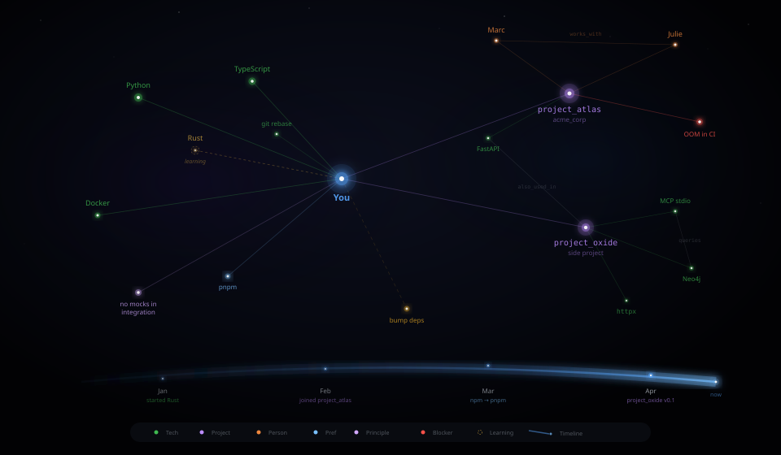

# graph-mem

**Your AI coding assistant forgets everything between sessions. graph-mem fixes that.**

[](https://pypi.org/project/graph-mem/)
[](https://www.python.org/downloads/)
[](LICENSE)
[](https://github.com/quequiere/graph-mem/issues)

> **⚠️ Not usable yet.** This is the first development milestone — the code is written but the project has not been tested end-to-end against a live Graphiti instance. Do not try to use it yet. Follow the repo or [open an issue](https://github.com/quequiere/graph-mem/issues) to be notified when it's ready.

<p align="center">
  
</p>

## What it looks like in practice

**Session 1** — Working on a FastAPI project with Julie. graph-mem learns:
> *"Developer uses Python, works on project_atlas with Julie (tech lead), prefers pnpm, uses TDD."*

**Session 12** — You start learning Rust on a side project. graph-mem adds:
> *"Developer is learning Rust (beginner), started project_oxide, still active on project_atlas."*

**Session 47** — You open a new terminal. Before you type anything, your assistant already knows:
> *"You're in the project_atlas repo. Julie pushed a migration yesterday. There's a CI blocker (OOM on E2E tests). You prefer no mocks in integration tests. Reminder: bump deps to v2.1."*

This happens automatically via Claude Code hooks — no manual prompt engineering required.

## Why not just use CLAUDE.md or mem0?

`CLAUDE.md` is a static file you maintain by hand — it doesn't track relationships or evolve over time. mem0 is a flat vector store that retrieves similar text; it doesn't know that Julie is your tech lead on project_atlas, or that the OOM blocker is blocking *that specific project's* CI. graph-mem builds a **temporal knowledge graph**: entities connect to each other, facts carry timestamps, and the graph grows smarter as you work.

> **Privacy:** Neo4j and Graphiti run locally in Docker — your graph data stays on your machine. Entity extraction requires an OpenAI API call: session summaries and saved facts are sent to OpenAI during that step. If this matters for your data classification policy, review what graph-mem stores before using it on sensitive work projects. Local/offline extraction via Ollama is on the roadmap.

## MCP — what is it?

[MCP](https://modelcontextprotocol.io) (Model Context Protocol) is the plugin system that lets tools like graph-mem extend what Claude, Cursor, and other AI assistants can do. If you use Claude Code or Cursor, you likely already have MCP support — you just add graph-mem to your config.

## Quick start

**Prerequisites:** Python 3.11+, Docker & Docker Compose (for Graphiti + Neo4j backend), OpenAI API key (required — used for entity extraction).

### Phase 1 — Start the backend (one-time setup)

```bash
git clone https://github.com/quequiere/graph-mem && cd graph-mem
docker compose up -d
```

This starts Graphiti and Neo4j locally. Neo4j requires ~2 GB of available RAM.

### Phase 2 — Connect your client

**Install graph-mem:**

```bash
pip install graph-mem
# or run without installing: uvx graph-mem
```

**Add to Claude Code** (`~/.claude/claude_desktop_config.json` or via `claude mcp add`):

```json
{
  "mcpServers": {
    "graph-mem": {
      "command": "uvx",
      "args": ["graph-mem"],
      "env": {
        "GRAPHITI_URL": "http://localhost:8000",
        "OPENAI_API_KEY": "sk-..."
      }
    }
  }
}
```

Same config block works for Cursor, Windsurf, and any other MCP-compatible client.

**Enable automatic hooks (Claude Code only):**

Add to `~/.claude/settings.json` for automatic context injection at session start and auto-save at stop:

```json
{
  "hooks": {
    "SessionStart": [{ "command": "graph-mem-session-start" }],
    "Stop": [{ "command": "graph-mem-session-end", "blocking": true }]
  }
}
```

`graph-mem-session-start` and `graph-mem-session-end` are CLI commands installed with `pip install graph-mem`. The `Stop` hook has a 30-second timeout — if Graphiti is unreachable, it exits with a warning and your session ends normally (no data loss; re-save manually via `save_session` next time). Without hooks, call `get_context` and `save_session` manually from the chat.

## What gets stored?

graph-mem captures the **essence** of your work — not your code. Here's what the knowledge graph tracks:

| Entity type | Examples | How it's captured |
|---|---|---|
| **Developer profile** | Expertise, seniority, habits | Accumulated across sessions |
| **Technologies** | Languages, frameworks, tools | Detected from project context |
| **Projects** | Name, stack, team, status | `onboard_project` or auto-detected |
| **People** | Colleagues, roles, relationships | Mentioned in conversations |
| **Preferences** | Tooling choices, coding style | Stated or observed over time |
| **Principles** | "TDD always", "no mocks in integration" | Stated by the developer |
| **Blockers** | CI failures, environment issues | Reported during sessions |
| **Reminders** | "bump deps", "renew API key" | Explicit `add_reminder` calls |
| **Decisions** | Architecture choices, trade-offs | Captured in session summaries |

Everything is **temporally aware** — graph-mem knows when you started learning Rust, when you switched from npm to pnpm, and when a blocker was resolved.

## MCP Tools

### High-level tools

| Tool | What it does |
|---|---|
| `get_context` | Injects your full profile + current project context + active reminders |
| `onboard_project` | Analyzes and memorizes a new project's structure, stack, and team |
| `save_session` | Summarizes and persists the current session to the knowledge graph |
| `save_memory` | Stores a specific fact, preference, or decision |
| `get_profile` | Retrieves your developer profile |
| `check_project` | Checks whether the current project is known; suggests onboarding if not |
| `add_reminder` | Adds a reminder that will surface in future sessions |
| `get_reminders` | Lists active reminders |

### Passthrough tools (direct Graphiti access)

| Tool | What it does |
|---|---|
| `add_raw_memory` | Adds raw text or JSON directly to the knowledge graph |
| `search_entities` | Searches for entities (nodes) by natural language |
| `search_facts` | Searches for facts (relationships) between entities |
| `reset_memory` | Clears memory for a given scope (`user_profile` or `project_{identifier}`) — destructive, cannot be undone |
| `status` | Checks Graphiti connection health |

## Architecture

```
Your machine                          Docker (local or remote)
┌──────────────────────┐              ┌──────────────────────┐
│ Claude Code / Cursor  │              │  Graphiti REST API   │
│         │             │              │         │            │
│    stdio │             │    HTTP      │    graphiti_core     │
│         ▼             │ ──────────►  │         │            │
│  graph-mem MCP server │              │       Neo4j          │
└──────────────────────┘              └──────────────────────┘
```

- **graph-mem** runs locally as an MCP server (stdio transport)
- **Graphiti** runs in Docker, handles entity extraction, embeddings, and graph storage
- Communication is plain HTTP — no JSON-RPC, works behind corporate proxies
- Memory is scoped by `user_profile` (global) and `project_{identifier}` (per-repo, derived from git remote URL); both scopes are merged at query time

## Built on

- **[Graphiti](https://github.com/getzep/graphiti)** — Temporally-aware knowledge graph framework by Zep
- **[FastMCP](https://github.com/jlowin/fastmcp)** — Python MCP server framework
- **[Neo4j](https://neo4j.com)** — Graph database backend

## Contributing

Open an issue first to discuss what you'd like to change. Pull requests welcome.

### Local development

**Prerequisites:** Python 3.11+, [uv](https://docs.astral.sh/uv/), Docker & Docker Compose.

#### 1. Clone and start Graphiti + Neo4j

```bash
git clone https://github.com/quequiere/graph-mem && cd graph-mem
cp .env.example .env
# Edit .env — set OPENAI_API_KEY (OpenRouter, Ollama, or any OpenAI-compatible provider)
docker compose up -d --build
```

Verify Graphiti is healthy:

```bash
docker compose ps
curl http://127.0.0.1:8000/healthcheck
```

#### 2. Run tests

```bash
# Unit tests (no Docker needed)
uv run pytest tests/ -v

# Integration tests (requires Docker running)
uv run pytest tests/integration/ -v -m integration
```

#### 3. Configure Claude Code MCP server

Register graph-mem as an MCP server using `uv run` so changes are picked up immediately without reinstalling:

```bash
claude mcp add graph-mem -s user -- uv run --directory /path/to/graph-mem graph-mem
```

#### 4. Configure Claude Code hooks

Add to `~/.claude/settings.json`:

```json
{
  "hooks": {
    "SessionStart": [
      {
        "matcher": "startup|clear|compact",
        "hooks": [
          {
            "type": "command",
            "command": "uv run --directory /path/to/graph-mem graph-mem-session-start",
            "timeout": 10
          }
        ]
      }
    ],
    "Stop": [
      {
        "hooks": [
          {
            "type": "command",
            "command": "uv run --directory /path/to/graph-mem graph-mem-session-end"
          }
        ]
      }
    ]
  }
}
```

Replace `/path/to/graph-mem` with your clone's absolute path.

#### 5. Configure VS Code MCP server (optional)

Add to `.vscode/mcp.json` in any project where you want graph-mem available:

```json
{
  "servers": {
    "graph-mem": {
      "command": "uv",
      "args": ["run", "--directory", "/path/to/graph-mem", "graph-mem"],
      "type": "stdio"
    }
  }
}
```

#### 6. Interactive debugging with MCP Inspector

Test MCP tools interactively without Claude Code:

```bash
npx @modelcontextprotocol/inspector uv run --directory /path/to/graph-mem graph-mem
```

This opens a web UI where you can call `save_memory`, `search_memory`, etc. and inspect responses.

#### 7. Graph viewer

While the MCP server is running, a graph viewer is available at:

```
http://127.0.0.1:8050
```

You can also browse the raw graph via Neo4j Browser at `http://127.0.0.1:7474` (login: `neo4j` / `graphiti`).

## License

Apache-2.0 — see [LICENSE](LICENSE)
